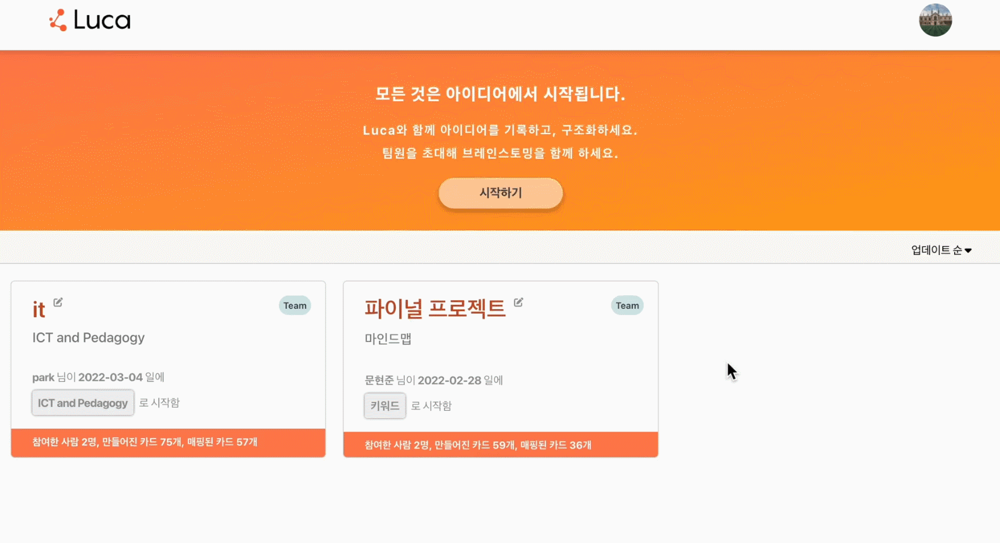
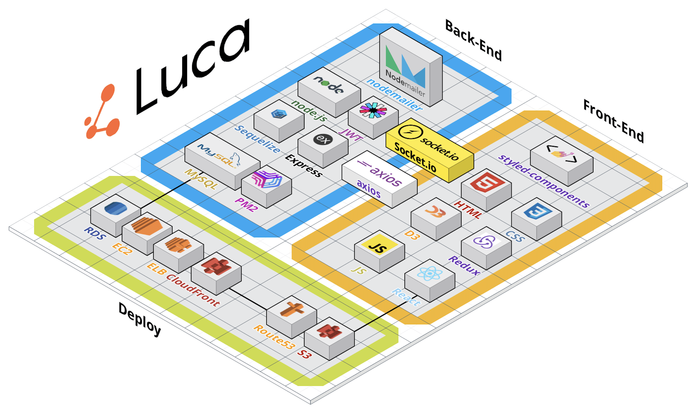

# Luca

브레인 스토밍에서 나온 아이디어를 마인드맵으로 구성할 수 있는 실시간 아이디에이션 기획 툴입니다.

🏠 &nbsp; <a href="https://luca.solutions/">Luca Homepage</a>

&nbsp;

### ⏳ &nbsp; Project period

- 2022.02.07 ~ 2022.03.08 (4주)

 

## ✨ &nbsp; Feature

- 아이디어를 카드 형식으로 빠르게 작성할 수 있다.
- 마인드맵에 아이디어 카드를 추가하고 연결할 수 있다.
- 프로젝트를 개인과 팀으로 구분해서 생성할 수 있다.
- 팀프로젝트는 실시간으로 마인드맵 컨텐츠를 공유할 수 있다.

 

## 😇 &nbsp; Contributing

> Team _CodeJunkies_

- 임명섭 <a href="https://github.com/portis082">Github</a> - Back-end (Team leader)
- 문현준 <a href="https://github.com/QuatoHub">Github</a> - Back-end
- 지원재 <a href="https://github.com/WonjaeJi0801">Github</a> - Front-end
- 이윤성 <a href="https://github.com/flowervillagearp">Github</a> - Front-end

 

## 📚 &nbsp; Document

- <a href="https://www.notion.so/4-CodeJunkies-Luca-ba9bc432b86f449dbec4a71bff86f40f">Notion 바로가기</a>

- <a href="https://github.com/codestates/luca/wiki">Wiki 바로가기</a>

 

## 🔗 &nbsp; Link

- `Main` > <a href="https://github.com/codestates/luca">https://github.com/codestates/luca</a>

- `Client` > <a href="https://github.com/codestates/luca/tree/main/luca-client">https://github.com/codestates/luca/tree/main/luca-client</a>

- `Server`> <a href="https://github.com/codestates/luca/tree/main/luca-server">https://github.com/codestates/luca/tree/main/luca-server</a>

 

# 🙋🏻 &nbsp; Luca 서비스 소개

 

### • About and Main

&nbsp;

### • 비회원 로그인 (체험하기)

&nbsp;

### • 팀 프로젝트 생성 (팀원 초대)

&nbsp;

### • 실시간 카드, 마인드맵 동작

&nbsp;

### • 검색 및 컨트롤 패널

&nbsp;

## ❓ 어떤 기술이 사용되었나요

 

### 📐 &nbsp; Wireframe

 

### 📂 &nbsp; API Documentation

<a href="https://app.swaggerhub.com/apis-docs/portis082/luca/1.0.0">🍎 &nbsp; API 보러가기</a>

 

### 🗄 &nbsp; DB schema

<a href="https://dbdiagram.io/d/62034df385022f4ee56086d1">🍑 &nbsp; DB schema 보러가기</a>
